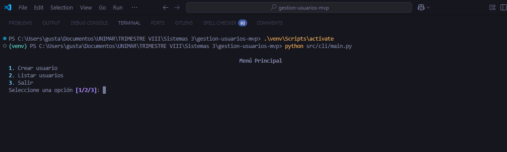
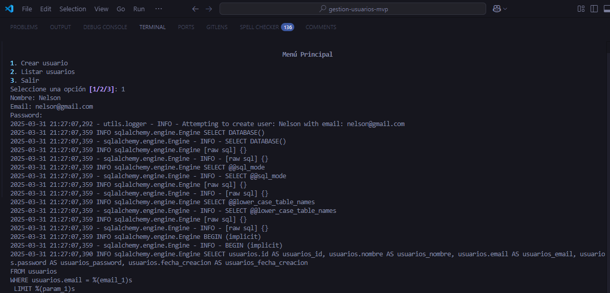
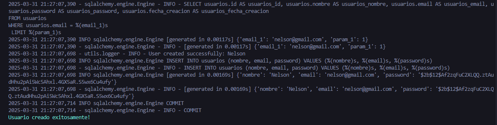
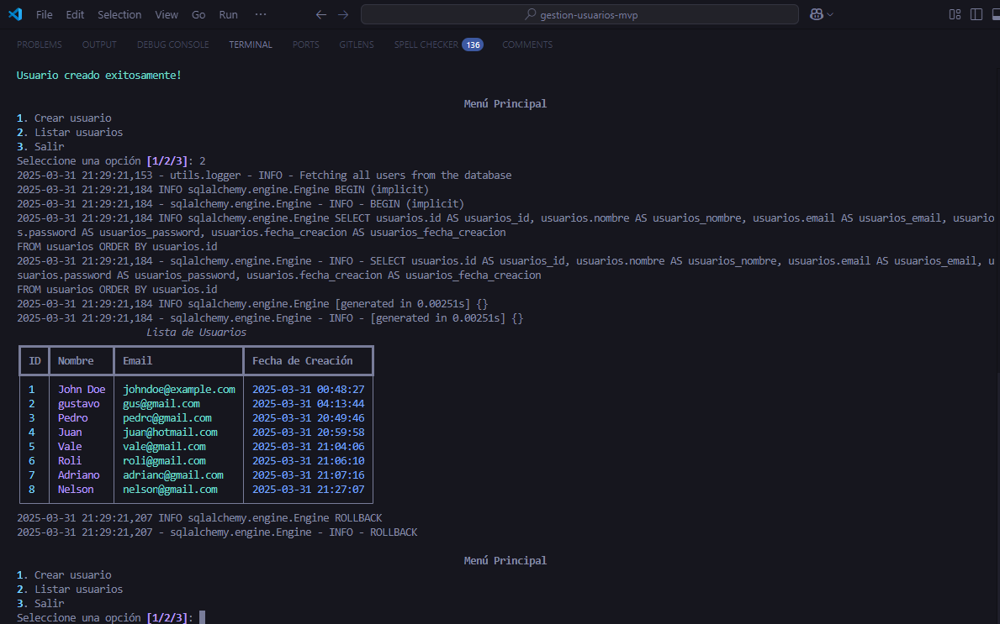
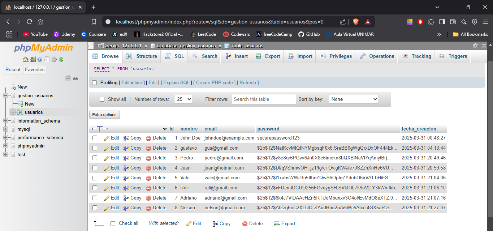
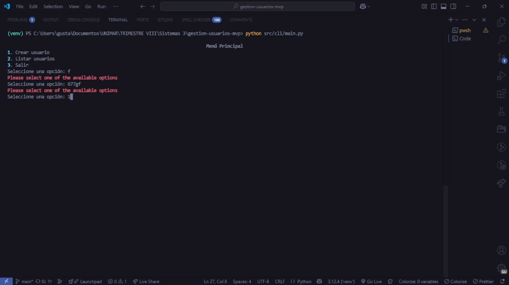

# Gestión de Usuarios

Este proyecto es una aplicación de línea de comandos para gestionar usuarios. Permite crear usuarios, listar usuarios y validar datos como correos electrónicos.

## Características

- Crear usuarios con validación de datos.
- Listar usuarios en una tabla interactiva.
- Validación de correos electrónicos y contraseñas.

## Configuración del Proyecto

**1. Clona el repositorio:**

```bash
    git clone https://github.com/tu-usuario/gestion-usuarios.git
    cd gestion-usuarios
```

**2. Crea un entorno virtual:**

```bash
    python -m venv venv
    source venv/bin/activate # Linux/Mac
    venv\Scripts\activate
```

**3. Instala las dependencias:**

```bash
    pip install -r requirements.txt
```

**4. Configura la base de datos:**

- Asegúrate de tener [XAMPP](https://www.apachefriends.org/) y ejecutando MySQL.
- Crea una base de datos llamada `gestion_usuarios`.
- Configura el archivo `.env` con la URL de conexión:

  `DB_URL=mysql+mysqlconnector://root:@localhost:3306/gestion_usuarios`

**5. Instala el proyecto en modo editable:**

```bash
    pip install -e
```

## Cómo Ejecutar el Proyecto

**1. Ejecuta el siguiente comando para iniciar la aplicación:**

```bash
    python src/cli/main.py
```

**2. Interactúa con el menú:**

- Opción 1: Crear usuario.
- Opción 2: Listar usuarios.
- Opción 3: Salir.

## Capturas de Pantalla

### Menú Principal



### Crear Usuario




### Listar Usuarios



### Registros de la Base de Datos



## Video de Demostración

A continuación, se muestra un video de demostración del programa en funcionamiento:

[](https://drive.google.com/file/d/1CnRohmsIGHoNzJ6yvsJGJKLbNa814eeE/view?usp=drive_link)

## Documentación Adicional
