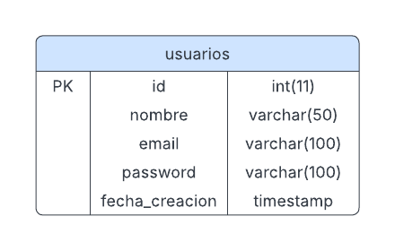

# Diagrama ER de la Base de Datos

Este documento describe la estructura de la base de datos utilizada en el proyecto "Gestión de Usuarios".

## Diagrama ER

A continuación, se muestra el diagrama entidad-relación (ER) de la base de datos:

---

## Descripción de la Tabla `usuarios`

La base de datos contiene una tabla principal llamada `usuarios`, que almacena la información de los usuarios registrados en el sistema.

### Estructura de la Tabla

| Campo           | Tipo de Dato      | Restricciones                  | Descripción                                |
|------------------|-------------------|--------------------------------|--------------------------------------------|
| `id`            | `Integer`         | `PRIMARY KEY`, `NOT NULL`      | Identificador único del usuario.           |
| `nombre`        | `String(50)`      | `NOT NULL`                     | Nombre del usuario.                        |
| `email`         | `String(100)`     | `UNIQUE`, `NOT NULL`           | Correo electrónico único del usuario.      |
| `password`      | `String(100)`     | `NOT NULL`                     | Contraseña encriptada del usuario.         |
| `fecha_creacion`| `DateTime`        | `DEFAULT CURRENT_TIMESTAMP`    | Fecha y hora de creación del registro.     |

---

## Explicación de los Campos

1. **`id`**:
   - Es la clave primaria de la tabla.
   - Se utiliza para identificar de manera única a cada usuario.

2. **`nombre`**:
   - Almacena el nombre del usuario.
   - Solo permite letras y espacios, incluyendo caracteres acentuados y la letra `ñ`.

3. **`email`**:
   - Almacena el correo electrónico del usuario.
   - Debe ser único para evitar registros duplicados.

4. **`password`**:
   - Almacena la contraseña del usuario en formato encriptado.
   - Nunca se guarda la contraseña en texto plano por razones de seguridad.

5. **`fecha_creacion`**:
   - Registra la fecha y hora en que se creó el usuario.
   - Se genera automáticamente al insertar un nuevo registro.

---

## Archivos Relacionados

- [Modelo de Usuario](../src/models/user.py)
